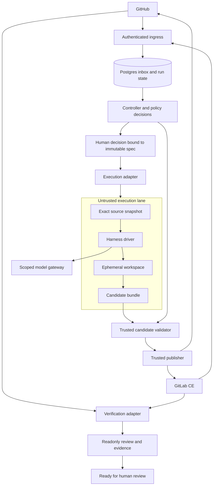

# Forge: code review и план модульной software factory

Дата: 13 сентября 2026. Репозиторий: `forcewake/forge`. Зафиксированный baseline: `6115523818bc363e4d671a991722eaad4e288d12`, v0.1.0.

## 1. Решение

**GitHub добавлять в этот же репозиторий. Архитектуру разделить на независимые модули, но пока не на независимые репозитории и микросервисы.** Рекомендуемая форма — modular monolith в monorepo, один согласованный release train, отдельные execution images там, где действительно отличаются зависимости и границы доверия.

Сначала исправить data integrity, общий write boundary и durable execution. Иначе новый GitHub adapter размножит те же дефекты. `GitLab CE + builtin`, `GitLab CE + Codex` и `GitHub + Codex` должны отличаться конфигурацией адаптеров, а не тремя lifecycle engines.

Главная ценность Forge — не очередная реализация coding loop. Это единый управляемый путь от рабочей задачи до проверенного MR/PR, с подтверждением человека, воспроизводимым execution profile, учётом всех попыток и ограниченными полномочиями исполнителя.

## 2. Что действительно проверено

Проверены исходники runtime ingress, worker/queue, durable models/controller, RunService, builtin materialization, GitLab writes, CI quality contract, CLI templates, MCP, settings, DB lifecycle и release/CI конфигурация. Критические участки сопоставлялись между собой, а не только с README/ADR. Ссылки в backlog привязаны к SHA, поэтому более поздние изменения main не меняют результаты этого ревью.

Через GitHub прочитаны статус и jobs CI run `34757657069`. В просмотренном логе `test (3.13)`, job `103724729127`: **819 passed, 1 skipped, 3 xfailed, 1 warning**. Общий workflow завершился success. В `ci.yml` mypy имеет `continue-on-error: true`; зелёный workflow не доказывает, что typing является обязательным quality gate. В логе есть aiosqlite thread warning `Event loop is closed`.

Локально выполнены только три **сокращённых воспроизведения алгоритмов**, без импорта установленного Forge: усечение authoritative base, классификация отсутствующего CI evidence как code и shared nested defaults. Код и JSON-результат находятся рядом. Это не подмена полного unit/e2e прогона: полноценный checkout с зависимостями, реальный GitLab CE, concurrent Postgres и CLI providers в этом окружении не запускались. Предложенные regression tests синтаксически проверены, но против Forge не исполнялись.

Проверка не является penetration test развёрнутой системы. Например, upstream MCP открыт без обязательного key, но фактический reverse proxy пользователя не исследовался: возможность небезопасного deployment не означает подтверждённую публичную утечку.

## 3. Что уже стоит сохранить

В коде появились полезные элементы: явные lifecycle states, intent/outcome journal, точный candidate SHA для части CI evidence, Draft MR до завершения verification, отдельный readonly reviewer, bounded commit cycles, отсутствие auto-merge, exact-match materialization вместо fuzzy patch и сменный implementer backend. Не нужно выбрасывать эти решения и начинать новый framework.

Однако наличие таблиц `EventInbox`, `Outbox` и `StepRun` ещё не означает durable runtime. В текущем пути commands идут через прежнюю Redis queue, а step ownership и восстановление промежуточных состояний не обеспечивают обещанных гарантий. Аналогично `FORGE_RESULT` с корректным SHA подтверждает идентичность уже записанной ветки, но не авторизацию записи.

## 4. Приоритет исправлений текущей реализации

Полный список — **34 задачи** в `BACKLOG.md` и машиночитаемом `backlog.json`: 5 P0, 24 P1, 5 P2. Приоритет характеризует важность, зависимости — порядок. Расширение GitHub отмечено как новая функциональность, не как дефект GitLab baseline.

### 4.1. Сохранность файлов и snapshots

**F01 — первым.** `LLMImplementer._base_contents()` повторно использует `_fetch_contents()`, который ограничивает файл 6 000 символами. `materialize()` применяет exact replacement к обрезанному содержимому, а `validate_changeset()` не проверяет сохранность исходного хвоста. Результат сокращённого воспроизведения: файл 9 031 символ → 6 000, `violations=[]`. Исправление — два разных reader-контракта: bounded evidence для LLM и полный immutable blob для materialization.

**F02–F03.** Repair снова читает `run.base_sha`, хотя должен видеть предыдущий candidate. Writer при этом создаёт ветку от live target branch. Нужны минимум три раздельные сущности: согласованный source snapshot, база конкретной попытки, текущая целевая ветка. Не менять одно поле `base_sha` так, чтобы потерять первоначальный source oracle.

Критерий исправления: второй цикл умеет исправить файл, созданный первым, не откатывает другие изменения и не перезаписывает человеческий push. Snapshot должен быть проверяемым объектом, а не строкой `main`.

### 4.2. Единый write boundary

**F04–F07.** Builtin проходит path validation; harness напрямую получает PAT и делает push. Generic POST retry остаётся включённым для pipelines/MRs/notes. Unknown commit result ищется по message, который повторяется между repair cycles. Эти механизмы могут создать side effects, не соответствующие одному одобренному intent.

Нужен единый trusted publisher для любых кандидатов. У агента не должно быть remote write authority. Каждый intent получает уникальный operation ID, expected base/head и нормализованный content digest. Потеря ответа означает необходимость read/reconcile, а не автоматический повтор POST.

### 4.3. Durable ingress и исполнение

**F08–F12.** В runtime нет атомарного перехода от persisted webhook до step execution. Redis claim состоит из pop и tracking; delay фактически не применяется, heartbeat не продлевает task ownership. Controller leases и state transitions используют read-modify-write без необходимой защиты от второго connection. Reconciler охватывает ожидания CI/harness, но не весь lifecycle.

Минимальный надёжный runtime должен выдерживать смерть процесса после любой записи state и любого внешнего эффекта. Это проверяется на двух реальных worker processes и Postgres, а не только на sequential fake. Ограничение одной active run и одной gate generation — DB-инварианты.

### 4.4. Approval, cancellation и execution config

**F13–F16.** Cancel меняет запись в БД, но не отзывает право job на публикацию. Backend name сохранён, но adapter строится из текущих settings; policy digest отражает только approver list. Gate создаётся при /go, поэтому его TTL не ограничивает возраст ожидающего плана. Некоторые входы перечитываются после approval.

Нужны immutable RunSpec, pending decision с deadline при публикации плана, current actor authorization и publication grant, который можно отозвать. При cancel сначала запрещаются новые effects, затем best-effort останавливается executor; поздний результат не может «оживить» run.

### 4.5. Проверяемый CI и harness results

**F17–F21.** CI timeout не применяется к постоянно running pipeline; `classify_failure([])` возвращает `code`; empty required jobs превращает green icon в весь quality contract. SHA freshness проверяется до review, но может устареть во время него. Harness/model selector не доказывает, какой CLI реально выполнился.

Acceptance должен быть связан с source/candidate/tested revisions и версией verification profile. Candidate creation, code verification и readiness — разные события. Pipeline success нельзя использовать как доказательство того, что агент действительно выполнил указанную задачу.

### 4.6. Usage, config и packaging

**F22–F30.** Ledger не охватывает внутренние CLI calls и не реализует полный budget reservation. Read/redaction/log boundaries расходятся. Shallow config copy загрязняет defaults других экземпляров. Standalone image не выбирает PostgreSQL extra и не копирует все runtime assets; его требуется проверить реальным clean-image smoke. Startup `create_all` не является миграцией существующей БД. Management route всё ещё показывает legacy flows.

Это не причина строить десять новых сервисов. Это основание довести один понятный production profile до состояния, в котором documented quick start действительно воспроизводится без source mounts и скрытых ручных действий.

## 5. Результаты внешнего исследования и что из них следует

Ниже факты из первичных источников отделены от решений для Forge. Проверены официальные документы на дату исследования. CLI flags и API contracts необходимо закреплять в compatibility tests, а не считать вечными.

### 5.1. GitHub Agentic Workflows — полезнее, чем ещё один review bot

В gh-aw внешние записи отделены от read-only agent stage: предложения сохраняются как artifacts, проходят детерминированную обработку и публикуются privileged jobs с ограниченными правами. Это подходящий architectural reference для Forge. [R01]

**Решение для Forge:** заимствовать принцип staged authority и язык capabilities, но не переносить весь compiler/runtime. Сначала сопоставить собственные requirements: GitLab CE, cross-host lifecycle, durable approvals и внешний usage ledger. Для GitHub-only сценария, который полностью покрывает gh-aw, отдельная реализация может быть лишней. Наличие собственного GitHub adapter оправдано общей policy/evidence моделью, а не желанием повторить каждый native feature.

### 5.2. Codex

Официальный non-interactive интерфейс — `codex exec`; доступны JSON events и structured output schema. Документация показывает разделение code-generation job и отдельной job публикации PR через patch artifact. [R02]

**Решение для Forge:** отдельный `codex` HarnessDriver, локальный workspace внутри executor, машина состояний вне CLI. Не парсить человекочитаемый terminal output. CLI output — evidence, не authority. Версия Codex/image фиксируется; settings/permissions не берутся бесконтрольно из рабочей директории. Существующий shell-шаблон не заменять одной «универсальной» bash-командой для всех providers.

### 5.3. Claude Agent SDK и Claude Code CLI

Agent SDK предоставляет agent loop Claude Code на Python/TypeScript, включая sessions, hooks, permissions и usage mechanisms. Официальная документация отдельно ограничивает использование claude.ai login/limits в сторонних продуктах без предварительного разрешения. [R03]

**Решение для Forge:** SDK предпочтителен, когда нужна programmatic lifecycle интеграция; CLI subprocess остаётся поддерживаемым transport там, где это проще. В обоих случаях процесс выполняется в менее доверенном execution environment, не в API/control-plane process. API/service credentials и consumer session login — разные auth profiles; BYOK не обещает перенос подписки в произвольный серверный продукт. Условия и naming проверять перед публичной дистрибуцией.

### 5.4. Grok Build и OpenCode

Grok Build имеет официальный headless CLI, model selector, sessions, JSON/streaming-json и ACP transport; это отдельный coding harness, не только семейство моделей. [R04] OpenCode имеет собственный SDK/server API; это ещё один допустимый driver, но не основание хранить его provider-specific config в core. [R05]

**Решение для Forge:** различать `grok-build` как driver и `xai/<model>` как route. Для OpenCode JSON config генерировать безопасным сериализатором, не sed-подстановкой в heredoc. Для каждого driver зафиксировать auth, result protocol, cancel/resume semantics и supported providers. «OpenAI-compatible» endpoint сам по себе не доказывает совместимость tool calls, usage или reasoning.

### 5.5. ACP и MCP

ACP стандартизирует часть client-agent взаимодействия, sessions и сообщения. Это полезный дополнительный transport для совместимых harnesses, но не полная модель авторизации software factory. [R06]

**Решение для Forge:** не делать ни MCP, ни ACP universal bus для собственного core. MCP относится к инструментам/ресурсам, ACP — к управлению агентской сессией. Run identity, durable workflow, source publication, verification и budget accounting остаются собственными контрактами. ACP adapter можно добавить после двух реально работающих drivers и conformance tests.

## 6. Что именно должно быть независимыми «кубиками»

### 6.1. Source/collaboration adapter

GitLab CE и GitHub владеют repositories, issues, comments, branches, MR/PR, identities и частью CI evidence. Adapter переводит native события/объекты в доменные DTO, но сохраняет достаточно native metadata для диагностики и точной корреляции.

Не делать единый `PlatformClient` на сотни методов. Разделить порты по нужным эффектам: WorkItems, RepositoryReader, ChangeRequests, VerificationReader, IdentityResolver и PublicationWriter. Одна GitLab adapter implementation может реализовывать несколько портов без создания отдельных deployment services.

`project_id:int` не должен быть глобальной идентичностью. Использовать connection ID + provider + opaque repository ID. GitLab IDs могут повторяться между инстансами; native identity не равна display path, который может измениться. Issue identity содержит repository scope; actor ID — connection scope. Нельзя сравнивать GitHub login и GitLab username как одного человека без явно настроенного mapping.

### 6.2. Execution backend

GitLab CI, GitHub Actions и будущий isolated local/Kubernetes executor — место запуска, получения артефактов и отмены job. Это не coding harness и не проверка качества.

Контракт: `launch`, `poll`, `cancel`, `collect_artifact`, `reconcile_launch`. Typed handle содержит external run ID, attempt, immutable spec digest и timestamps. Executor объявляет capabilities: network control, resource limits, artifact integrity, cancellation granularity, immutable checkout, supported image/runtime.

Не обязательно поддерживать весь Cartesian product. GitHub source + GitLab executor может быть технически возможен, но его лучше запретить, пока нет проверенного recipe и ясной custody исходников/артефактов.

### 6.3. Harness driver

Builtin structured proposer, Claude SDK/CLI, Codex, Grok Build и OpenCode решают задачу внутри выданного workspace. Driver знает только свой invocation/config/events/result format. Он не принимает ORM session, не вызывает `create_merge_request`, не выбирает approvals и не обновляет FlowRun.

Контракт завершения содержит exit classification, candidate artifact, raw event log reference и usage receipt reference. Наличие изменения файлов не превращает failed/aborted execution в success; может быть `partial_candidate`, который требует отдельного policy decision.

Существующий `ImplementerBackend` полезен как временная точка входа, но недостаточен как внешний plugin API: start/poll со строковым handle и FlowRun ORM следует постепенно заменить.

### 6.4. Model route и credentials

**BYOK — режим владения credentials, не harness.** В одном профиле можно использовать тот же OpenCode driver с разными разрешёнными routes. В другом — builtin proposer через локальный gateway. Возможность Claude/Grok/Codex переключаться на route доказывается конкретным adapter/compatibility contract, а не общим полем `api_base`.

ModelRoute хранит provider protocol, endpoint reference, requested model, capabilities и policy classification; credential_ref указывает в secret broker. Effective model сохраняется из trusted provider receipt/telemetry, когда это доступно. Если gateway скрывает resolved model, поле остаётся unknown с указанием источника ограничения, а не заполняется предположением.

Credential broker отделяет installation/writer credentials от model credentials. Секретам не место в `.forge.yml`, RunSpec, repository artifacts, process arguments и Git remote URL. Для long-running workloads — scoped grant, refresh/revoke outside untrusted workspace, либо честно ограниченный режим для provider, не поддерживающего такой сценарий.

### 6.5. Trusted publication

Это не опциональный plugin поведения агента. Publisher проверяет CandidateBundle, нормализует net change, сравнивает базу, применяет policy и dispatch-ит журналируемый write.

Ни read-only review, ни JSON schema, ни signed report из той же agent job не заменяют эту границу. Внутри скомпрометированной job нельзя хранить секрет, который будет «доказывать», что результат job доверенный. Аттестация runner подтверждает происхождение исполнения, но не корректность предложенного кода.

### 6.6. Policy/gates и workflow runtime

Policy описывает разрешённые capabilities, budgets, paths, dependencies, artifacts и verification requirements. Project config может выбирать только допустимое либо ужесточать; он не может расширять доверие через deep merge.

Workflow runtime владеет state, retries, timers, approval generations, cancellation и action reconciliation. Отдельный plugin вправе предложить новую recipe, но не снимать обязательную authorisation или напрямую писать state в DB.

Для ближайшего релиза оставить небольшую typed state machine на Postgres и довести её гарантию. Отдельно принять ADR о Temporal только при доказанной необходимости большого числа long-running workflows/timers/operators. Не держать собственную state machine, legacy flows и Temporal тремя владельцами одного запуска. Любой durable engine всё равно требует idempotent/reconcilable external effects.

## 7. Целевая схема доверия



В этой схеме границы процессов и credentials важнее количества репозиториев. Source-host write tokens находятся у publisher, не в execution lane. Изоляция harness не ограничивается флагом `IS_SANDBOX=1` или `--always-approve`; она должна быть свойством executor profile. GitLab прямо предупреждает, что CI исполняет произвольный код и требует соответствующей модели доверия runners. [R07]

Trusted publisher не выполняет команды из candidate, не запускает hooks и не загружает agent-generated config. Для публикации нужно сериализованное представление файлов/операций и проверенный base; нельзя переносить raw `.git` целиком из менее доверенного окружения. Remote effects после cancellation технически блокируются проверкой актуального grant.

## 8. Контракты данных и версия протокола

Начать с небольшого `forge.contracts`, использующего dataclasses/Pydantic models без GitLab/GitHub SDK и ORM. Примеры ниже — проектируемая схема, не API, уже существующее в v0.1.0.

### 8.1. Immutable RunSpec

```text
RunSpec
  schema_version
  run_id, attempt_id, work_package_id, role_episode_id
  subject: connection_id, provider, repository_id, issue_id
  source_snapshot: source_base_oid, attempt_base_oid, target_branch
  plan_artifact_ref, plan_digest, task_digest
  policy_digest, verification_profile_digest, config_digest
  execution_profile_id, executor_version
  harness_id, harness_version, image_digest, template_digest
  model_route_ref, credential_ref
  budgets: wallclock, calls, tokens, cost, files, bytes, commit_cycles
  approval_generation, expires_at
```

Digest считается от канонической сериализации material effective settings, не от имени config file. Credentials — только ссылки, чтобы revoke/rotation работали без записи секрета в неизменяемый документ. Changes in model route or security policy не должны молча менять уже одобренный spec.

### 8.2. CandidateBundle

```text
CandidateBundle
  schema_version, run_id, attempt_id, run_spec_digest
  source_snapshot_oid, attempt_base_oid
  artifact_ref, artifact_digest, size_bytes
  changes_manifest: path, operation, old_blob_oid, new_content_digest, mode
  driver_exit_status, result_classification
  logs_ref, raw_usage_ref
```

Remote URI передаётся как reference из разрешённого artifact store, а не произвольный URL из model output. Archive extraction защищается от traversal/symlinks/zip bombs. Первоначально разрешить текстовые файлы и явно отклонять modes/binary/LFS/submodules, которые ещё не поддержаны. Не превращать unsupported в lossy UTF-8 conversion.

### 8.3. ExecutionHandle

Handle содержит connection/executor identity, native run ID, attempt и run_spec_digest. `poll(handle)` не читает текущий default harness из Settings. После потери launch response `reconcile_launch(intent)` ищет существующий run по operation correlation; он не создаёт второй pipeline на всякий случай.

### 8.4. VerificationResult

Нужны **три** разные ревизии: `subject_head_oid`, `target_base_oid`, `tested_oid`. GitHub PR CI может тестировать synthetic merge revision, поэтому буквальное равенство tested SHA и head SHA не является универсальным правилом. [R08]

Дополнительно сохраняются native workflow ID, attempt, trusted producer/application, definition ref/digest, required checks, artifacts и completeness. Success check с правильным name, но от другого producer, не должен удовлетворять контракту. Review decision также привязан к candidate/evidence snapshot; push после review инвалидирует freshness.

### 8.5. Source adapter capabilities

Не сглаживать различия GitHub/GitLab до lowest common denominator и не обещать эквивалентность там, где её нет. Например, GitHub `createCommitOnBranch` поддерживает `expectedHeadOid`, а GitLab `last_commit_id` — file-level precondition для определённых операций, не branch-wide CAS. [R09] [R10]

Capability manifest должен явно отвечать: поддерживается ли atomic multi-file commit с expected head, binary/mode updates, check publisher identity, pipeline cancellation, protected-branch inspection и полный diff. Recipe допускается только при удовлетворении нужных guarantees или при явно названном ограниченном профиле.

## 9. GitHub adapter: точный объём первого slice

### 9.1. Authentication и installation model

Для production выбрать GitHub App: installation-scoped access, минимальные repository permissions и краткоживущие installation tokens. Официальный срок token — один час; repository и permission scope можно сузить при выпуске. [R11]

Private key — только у trusted credential broker. Не выдавать admin permissions и bypass rulesets ради удобства. Не утверждать, что GitHub предоставляет универсальный scope «может commit, но никогда merge»: собственный no-merge contract должен поддерживаться API surface publisher и branch protection/rulesets, без bypass.

Начальный минимальный набор нужно валидировать по используемым endpoints: чтение metadata/content/issues/PR; scoped writes content/PR/comments; actions permissions только executor path; checks write только если Forge публикует собственный check. Не запрашивать org-wide права, которых нет в vertical slice.

### 9.2. Webhooks и команды

Отдельный GitHub ingress валидирует `X-Hub-Signature-256` на raw bytes перед JSON parsing. [R12] После auth нормализуются delivery ID, connection/installation, repository, actor, event kind/action и native object IDs. Внутренний unique key включает connection; доставка и содержательная команда имеют отдельные identities.

Первый UX: issue comment `/implement`, `/go <run>` и `/cancel <run>`, затем trigger label. Assignment-to-app не обещать как автоматическое свойство обычной App integration. Native GitHub coding-agent UX — отдельный продуктовый контракт, не следствие создания bot account.

`issue_comment` приходит и для PR; routing должен различать object type. Отфильтровать собственные command comments, но не отбрасывать собственные CI/push events, нужные для reconciliation. Webhook — сигнал перепроверить состояние, не полное окончательное evidence.

### 9.3. Публикация

Для text-only candidate использовать GraphQL `createCommitOnBranch` с `expectedHeadOid`: одна согласованная операция с ожидаемым head. [R09] `clientMutationId` не считать самостоятельной гарантией idempotency. Record intent, reconcile actual commit после неоднозначного ответа.

Создавать Draft PR после первого опубликованного candidate, до ожидания MR/PR-specific verification. Повторный ensure ищет PR по run/branch correlation. Сохранять display number и stable native identity. Не генерировать новую PR на каждый repair; новый attempt изменяет candidate того же work item при соблюдении policy.

### 9.4. Actions и доверенные workflows

Trusted workflow definition должна быть зафиксирована отдельно от candidate source. Generation job не получает publication token. Verification job с untrusted code не получает production secrets. В первой beta — same-repository work items; privileged fork workflow отложить до отдельного threat model.

Не использовать `pull_request_target` как удобный способ выдать secrets и затем запустить head из недоверенного PR. [R08] Trigger selection проверяется контрактными fixtures и реальным canary. Для App-triggered runs ожидаемая стратегия должна быть явной, а не зависеть от случайного cascade.

Актуальная документация GitHub отдельно описывает ограничения событий от `GITHUB_TOKEN`: push не создаёт обычный recursive push workflow; explicit dispatch имеет исключения; PR opened/synchronize/reopened может создавать требующие approval workflows. Поэтому старое правило «этот token никогда не запускает PR CI» тоже нельзя закодировать как неизменный факт. [R13]

### 9.5. Приёмка GitHub beta

Один небольшой seed repository проходит same-repo issue → approved plan → candidate → Draft PR → нужный Actions/check profile → readonly review → evidence. В отдельной проверке истекает token, удаляется installation, дублируется webhook, теряется ответ commit/PR creation, приходят поздние events и происходит человеческий push. Каждая ситуация заканчивается предсказуемо без незапрошенных side effects.

Не объявлять GitHub Enterprise Server поддержанным только потому, что `base_url` стал настраиваемым. Нужна версия API/capability matrix и реальный совместимый стенд; первая beta может честно поддерживать только GitHub.com.

## 10. Репозиторий, packages и deployment

### 10.1. Сначала реальные module boundaries

На первом шаге можно оставить один `src/forge` package и разделить namespaces/import contracts. Физически переносить в workspace packages после того, как хотя бы два source adapters или два drivers проверяют устойчивость границ. «Создать 12 pyproject.toml» не является архитектурным результатом само по себе.

Возможная целевая структура:

```text
forge/
  apps/
    forge-service/             # API, scheduler, worker entrypoints
  packages/
    forge-contracts/           # versioned DTO, capabilities, ports
    forge-core/                # lifecycle, policy, gate decisions
    forge-storage/             # Postgres repositories, inbox/outbox, ledger
    forge-integrations/
      gitlab/
      github/
    forge-execution/
      gitlab_ci/
      github_actions/
    forge-harnesses/
      builtin/
      claude/
      codex/
      grok_build/
      opencode/
    forge-models/              # routes, normalized usage, broker clients
  runner-images/               # independently pinned CLI environments
  recipes/                     # approved combinations and verification profiles
  migrations/
  tests/
    contracts/
    integration/
    failure_injection/
    e2e/
  docs/adr/
```

Названия — предлагаемая внутренняя структура; доступность distribution names в registries не проверялась. Для публичных packages выбирать namespace отдельно.

### 10.2. uv workspace и versioning

uv workspace позволяет управлять несколькими packages в одном репозитории с общим lockfile. [R14] Это подходит control plane и shared libraries. Общий lock означает общую совместимость зависимостей; несовместимые vendor CLI/SDK не нужно силой помещать в одну Python environment — они живут в отдельных executor images.

Пока один release version для набора официальных adapters и contracts, один tested compatibility manifest. Не поддерживать произвольные сочетания core0.2+adapter0.1+driverlatest без тестов. Для wire protocols отдельно schema_version и supported min/max. Старые active runs либо обслуживаются старым decoder/execution spec, либо явно draining/migrated; redeploy не переопределяет их семантику.

### 10.3. Plugins

Python entry points подходят для обнаружения заранее установленных plugins. [R15] Они не создают sandbox: импортированный plugin исполняет Python-код с правами процесса. Поэтому source-host/publisher plugins — trusted deployment artifacts с owner/review/allowlist; external coding harness не импортируется в control plane, а вызывается через isolated driver protocol.

Plugin SDK должен включать contract tests, fixture runner, capabilities manifest и правила версионирования. Запретить auto-download/pip install plugin по проектному YAML, изменяемому агентом. Installed, enabled и authorised-for-this-run — разные состояния.

### 10.4. Когда действительно разделять репозитории

Разделение оправдано, когда adapter поддерживается независимой командой и имеет свой release cycle, закрытую лицензию/дистрибуцию либо внешний maintainer. Другие основания — изолированные supply-chain policies или внешние consumers contract package. До этого multi-repo только затруднит атомарный rollout safety fix across core/adapters.

Deployment отдельно от repo: API/controller и low-trust harness **уже сейчас** должны иметь разные identities и execution environments. DB/scheduler separation может потребоваться по операционным причинам, но не потому, что пакеты лежат в разных папках.

## 11. Предлагаемая конфигурация «лего»

Ниже **future schema sketch**, не инструкция для текущего v0.1.0. Endpoint/secret refs демонстрационные. Настоящий loader должен сверять схему, разрешённые profiles и capabilities.

```yaml
schema_version: 1

connections:
  home_gitlab:
    provider: gitlab
    base_url: https://gitlab.example.internal
    credential_ref: secret://forge/gitlab/publisher
  github_team:
    provider: github
    app_installation_ref: secret://forge/github/team-installation

model_routes:
  coding_byok:
    protocol: openai-compatible
    endpoint_ref: config://approved-model-gateway
    model_ref: config://coding-model
    credential_ref: secret://forge/models/team-key
  local_review:
    protocol: openai-compatible
    endpoint_ref: config://private-local-endpoint
    model_ref: config://review-model

execution_profiles:
  isolated_gitlab:
    executor: gitlab-ci
    image_ref: config://pinned-opencode-image
    network_policy_ref: policy://agent-egress
    source_access: read-only
    publication_credentials: forbidden

recipes:
  gitlab_opencode_byok:
    source_connection: home_gitlab
    harness: opencode
    executor_profile: isolated_gitlab
    model_route: coding_byok
    publication_policy: policy://text-only-no-ci-changes
    verification_profile: policy://python-service-required-checks
    approval_policy: policy://project-maintainers
```

Profile compiler проверяет, что driver действительно поддерживает protocol/provider/model features, secrets принадлежат допустимому scope, executor выполняет isolation requirements, publisher обладает требуемыми concurrency capabilities, а verification достаточно строг. Неподдерживаемая комбинация отклоняется до первого LLM call или pipeline start.

Project `.forge.yml` может выбрать `gitlab_opencode_byok` и сузить scope. Он не может заменить `publication_credentials: forbidden` на разрешение, подключить новый endpoint или добавить себя в approvers.

## 12. Runtime design: что делать вместо текущего императивного service

### 12.1. Транзакция при входе

Валидировать provenance и command actor, записать inbox delivery/command, создать или найти уникальный run, добавить next-step/outbox. Только после commit отвечать 202. Payload retention отделён от durable identity; хранить чувствительные bodies только по policy и сроку.

### 12.2. Claim и выполнение шага

Scheduler выбирает due step с `FOR UPDATE SKIP LOCKED` либо atomic conditional UPDATE. Присваивает lease owner, expiry и возрастающий fencing generation. Snapshot входа immutable. Внешний HTTP/LLM вызов выполняется вне долгой transaction. Heartbeat продлевает lease конкретного шага, но после утраты ownership worker больше не может создавать effects.

Сам fence в БД не остановит уже отправленный POST у source host. Поэтому нужны constrained publisher, operation intents и reconciliation. Не называть это «exactly once» на всех внешних системах. Корректная цель — durable at-least-once orchestration с effectively-once business effects там, где это доказано adapter contract, и явным unknown state в остальных случаях.

### 12.3. Запись внешнего эффекта

Сохранить intent с operation ID, request digest, expected refs и correlation. Затем dispatch. Успех связывается с native ID и content evidence. Definitive reject фиксируется failed. При timeout/disconnect/неоднозначном серверном ответе — unknown, scheduling reconcile. Неизвестный результат не должен автоматически стать terminal failed и освобождать scope для второго конкурирующего run.

### 12.4. Timer и cancellation

`next_due_at`, absolute deadline и reason хранятся явно, а не извлекаются каждый раз из всей истории outbox. Состояние `cancel_requested` прекращает выдачу publication grants; executor получает cancel. Контроллер отражает partial effects, которые уже были применены до отмены, вместо обещания отката истории.

### 12.5. Выбор собственной state machine или Temporal

На ближайшем этапе узкий SQL runtime дешевле поддерживать при хорошо ограниченном workflow и уже существующей модели. Сделать его проверяемым важнее, чем выбрать название движка. Если появятся длительные многошаговые процессы, сотни timers, дочерние workflows и сложные operators, провести отдельный spike Temporal с тем же adversarial contract suite. Сравнивать recovery semantics и operational cost; не мерить только сокращение строк RunService.

## 13. Поэтапный план без остановки GitLab development

### Этап A — v0.1.x safety hotfix

**A1:** F01+F24+F18 — короткие детерминированные исправления с регрессиями. Их можно выпускать отдельно, не ждать большого рефакторинга.

**A2:** F02+F03+F06+F07 — snapshot integrity, repair base, operation-aware retries и reconciliation. Until complete: ограниченный single-writer profile, no implicit rebasing.

**A3:** F05+F16 — безопасный admission/API/MCP default. Dangerous harness write mode выключен по умолчанию до нового publisher contract; для собственного лабораторного режима он должен явно маркироваться unsupported-for-untrusted-workloads, а не выглядеть production default.

**Выход:** больший файл не теряет bytes; изменения не пишутся на неверную базу; неавторизованный trigger не тратит budget/не пишет; generic POST не повторяет возможный успешный эффект.

### Этап B — durable execution как действующая гарантия

**B1:** F08–F10 — реальные inbox/outbox, worker claims, CAS/fencing, unique invariants.

**B2:** F11–F15 — recovery каждого nonterminal state, immutable decision/spec, current permissions, cancel/timeout.

**B3:** F17+F19 — обязательный verification profile, stale-evidence invalidation и независимые deadlines.

**Выход:** одна команда, два worker processes, kill в каждой контрольной точке; после рестарта ровно один согласованный результат либо диагностируемый unknown/blocked. Нет orphan write после cancel и нет навсегда потерянного proposing.

### Этап C — contracts и GitLab adapter

**C1:** domain DTO и ports, import-boundary tests. Обернуть существующий GitLabClient, не переписывать всё transport layer.

**C2:** вынести из RunService admission, approval, proposal, publication, verification, notification. Каждая операция — bounded step с persisted input/result. Удалять legacy write dispatch постепенно, сохранять reactive agents через мост.

**C3:** connection/repository IDs и RunSpec schema migration. Backfill существующих GitLab runs на configured default connection; оставить чтение старых records, не заменять active backend на новый по умолчанию.

**Выход:** core тестируется без GitLab classes, и existing GitLab e2e остаётся зелёным. Официальный adapter реализует conformance contract, а не обходной путь.

### Этап D — общий безопасный harness pipeline

**D1:** F04+F20+F21 — CandidateBundle и publication worker. Новый runner wrapper забирает исходный snapshot, запускает driver, выгружает net candidate artifact, но не пушит.

**D2:** перенести уже существующие Claude/OpenCode/Grok templates на этот wrapper; добавить Codex как отдельный driver. Выбрать один основной driver для первого end-to-end доказательства; остальные добавлять через тот же тестовый контракт.

**D3:** F22+F23 — usage receipts, budget envelopes, evidence/redaction/retention. Run continuation использует pin versions и snapshot refs.

**Выход:** одинаковый набор запретов/отмены/валидации для builtin и CLI. Не появляются дополнительные native host writes при смене harness. Cross-harness сравнение имеет честную accounting completeness.

### Этап E — GitHub.com beta

**E1:** App setup, webhook normalization и readonly adapter; contract fixtures можно разрабатывать параллельно этапу C.

**E2:** GitHub+builtin same-repo slice с trusted API writer и normalised verification. Публичную write beta не включать до этапов A–B и обязательных политик.

**E3:** GitHub Actions executor запускает тот же candidate-based harness protocol. Обрабатываются documented trigger semantics, synthetic tested SHA и installation revocation.

**Выход:** одинаковая workflow recipe работает на GitLab/GitHub, source-specific различия ограничены adapter/capabilities. No fork privilege escalation; no mandatory GitHub-specific dependency в core.

### Этап F — распределяемый набор «лего»

**F1:** workspace/packages после стабилизации boundaries, supported profiles manifest, optional dependencies и отдельные CLI images.

**F2:** migration/release images, full API auth, `/runs`/metrics, plugin conformance kit, docs по upgrade/rollback/retention.

**F3:** acceptance cohort и capacity rebaseline, canary rollout нескольких профилей. Не позиционировать количество тестов как доказательство production-grade recovery без соответствующих failure tests.

**Выход:** новый пользователь выбирает supported recipe, получает заранее проверенные пакеты/образы, запускает doctor/admission, проходит один воспроизводимый issue-to-review сценарий без правок исходников.

Номера будущих версий (`0.2` для безопасного core/harness, `0.3` для GitHub beta) — возможная release scheme, не обещание даты или готовности. Перенос в workspace и добавление providers можно разделять, но нельзя распараллелить между ними несовместимые варианты safety contracts.

## 14. Тестовая стратегия и конкретные инварианты

### 14.1. На каждую правку

Pure domain tests для plans/spec digests, permission decisions, token bucket normalization и ChangeSet. Property-based tests на canonical paths, duplicate operations, encoding/modes, exact replacement и non-edited bytes. Не использовать только happy-path файлы короче truncation threshold.

Adapter contract suite с recorded sanitized payloads и explicit capability differences. Fake server не должен просто повторять assumptions текущего client: fixtures привязываются к documented/live responses. Включать пагинацию, limits, неполные diffs, retried jobs и endpoints raw/JSON.

### 14.2. Реальные Postgres и Redis

Проверять одновременно два независимых connection/process. Cases: concurrent create, concurrent approve, lease expiry/renewal race, stale owner completion, cancel-vs-publish, dispatcher double delivery и Redis loss. SQLite остаётся быстрым unit profile, но не доказательством Postgres concurrency semantics.

### 14.3. Failure injection

Crash после сохранения inbox; после step claim; после consumption gate; после внешнего commit и до receipt; после создания MR и до state save; во время waiting/review; после READY до notification. Для каждого test знать допустимые remote effects и критерий завершения. «Тест не бросил exception» недостаточно.

### 14.4. Изоляция execution lane

Canary workload пытается прочитать publisher credentials, использовать Docker socket, открыть запрещённый egress, изменить protected config, отправить фальшивый result, перепутать attempt и продлить job после cancel. Это контролируемые тесты собственного стенда, не эксплуатация внешних сервисов. Нужен evidence, что middleware/flags не являются единственной границей.

Не требовать доказательства отсутствия всех covert channels; documented threat model должен обозначить доверенную runner/host infrastructure и исключения. Гарантировать именно проверенные capabilities.

### 14.5. Release gate

Из чистого published image поднять service+Postgres+Redis; применить миграцию существующей v0.1 DB; запустить builtin и один CLI canary; проверить assets/agent YAML. Typecheck нового contracts/core — blocking. Любой xfail должен иметь issue и причину; нельзя превращать новый data-integrity defect в ожидаемое падение для сохранения зелёного badge.

## 15. Скорость токенов, budget и стоимость принятой работы

Прежний migration sizing из обсуждения — **условный workload**, не измеренная производительность нового Forge. В нём около 106 442 calls и 203,660 млн inclusive output за 135 рабочих дней. При дополнительно принятом окне 8h/day арифметика даёт примерно 99 calls/hour и 53 output tokens/s на весь пул. Эти величины не являются per-agent decode speed и не разрешают делить весь input+output traffic на tokens/s генерации.

Для модульной системы нужны разные counters: input_uncached, cache_read, cache_write, output_inclusive и optional output_reasoning_subset; provider-specific raw receipts сохраняются для аудита. Сначала определить, какие counters exclusive, а какие вложены, и только потом суммировать. Нельзя прибавить cache reads к input, уже содержащему cached tokens.

Если harness сообщает только агрегат за session, не выдумывать per-call детализацию. Хранить completeness=aggregate или unknown, expected lag, идентификатор provider receipt и source. Не считать route alias `code` доказательством фактической модели. Смену модели/harness фиксировать как изменение operating profile.

Резервирование budget — до dispatch. Для точного monetary hard cap нужен supporting gateway/provider quota; собственный post-hoc ledger не может остановить уже выполненные скрытые CLI calls. При отсутствии capability доступен ограниченный wallclock/concurrency envelope, с честным ограничением.

Capacity tests раздельно нагружают LLM routes, source APIs, CI queue, DB/scheduler и human review. Иллюстративный burst 3× среднего — удобный нагрузочный сценарий, не установленный p95/p99 и не множитель total token budget. Различать latency p50/p95, queue wait, TTFT, decode/visible output throughput и время до accepted unit.

Главная production метрика — accepted work packages и их evidence, включая расход failed/abandoned/superseded attempts. `ready_for_human` означает готовность к ревью, не human acceptance. Для migration profile отдельно сохранять source oracle, target behavior и решения keep/fix/exclude; Forge repository execution loop сам по себе не доказывает эквивалентность миграции.

## 16. Что осознанно не делать сейчас

Не разносить core и каждый adapter в отдельный repository до появления независимых maintainers. Не вводить service mesh/Kafka только ради модульности. Не публиковать arbitrary-plugin marketplace с auto-install из `.forge.yml`. Не писать собственный многомодельный CLI вместо интеграции существующих harnesses. Не обещать совместимость каждой модели с каждым драйвером. Не включать auto-merge, чтобы компенсировать медленный human review.

Не добавлять DAG designer и UI раньше, чем воспроизводятся cancel/recovery/candidate integrity. Не объявлять «поддержка GitHub» лишь по факту нового webhook parser. Полный slice обязан включать identity, writes, reconciliation, CI evidence и безопасный executor.

## 17. Первичные источники

Публичные документы ниже использованы для API и protocol facts, а не как доказательство работоспособности текущего Forge. Все предлагаемые границы/roadmap являются рекомендациями этого ревью.

- **R01:** GitHub Agentic Workflows, Security Architecture — https://github.github.com/gh-aw/introduction/architecture/
- **R02:** OpenAI Codex non-interactive mode — https://developers.openai.com/codex/noninteractive/ (официальный redirect на https://learn.chatgpt.com/docs/non-interactive-mode).
- **R03:** Claude Agent SDK overview — https://code.claude.com/docs/en/agent-sdk/overview
- **R04:** Grok Build headless/scripting — https://docs.x.ai/build/cli/headless-scripting
- **R05:** OpenCode SDK — https://opencode.ai/docs/sdk/
- **R06:** Agent Client Protocol overview — https://agentclientprotocol.com/protocol/v1/overview
- **R07:** GitLab Runner security — https://docs.gitlab.com/runner/security/
- **R08:** GitHub Actions event semantics — https://docs.github.com/en/actions/reference/workflows-and-actions/events-that-trigger-workflows
- **R09:** GitHub GraphQL commits / createCommitOnBranch / expectedHeadOid — https://docs.github.com/en/graphql/reference/commits
- **R10:** GitLab Commits API — https://docs.gitlab.com/api/commits/
- **R11:** GitHub App installation auth — https://docs.github.com/en/apps/creating-github-apps/authenticating-with-a-github-app/authenticating-as-a-github-app-installation
- **R12:** GitHub webhook signatures — https://docs.github.com/en/webhooks/using-webhooks/validating-webhook-deliveries
- **R13:** GitHub workflow trigger behavior — https://docs.github.com/en/actions/how-tos/write-workflows/choose-when-workflows-run/trigger-a-workflow
- **R14:** uv workspaces — https://docs.astral.sh/uv/concepts/projects/workspaces/
- **R15:** Python packaging entry points — https://packaging.python.org/en/latest/specifications/entry-points/
- **R16:** GitLab Merge Requests API — https://docs.gitlab.com/api/merge_requests/
- **R17:** gh-aw engine capabilities — https://github.github.com/gh-aw/reference/engines/

Pinned code и ссылки на конкретные функции представлены в `BACKLOG.md`. CI: https://github.com/forcewake/forge/actions/runs/34757657069 ; Python3.13 job: https://github.com/forcewake/forge/actions/runs/34757657069/job/103724729127 .

## 18. Практический итог

**Не переписывать Forge с нуля и не делать россыпь репозиториев.** Починить сохранность кандидатов и восстановление run, вынести общий publisher и contracts, затем добавить GitHub как второй source adapter и Actions как второй execution adapter. Claude/Codex/Grok/OpenCode подключаются как proposal-producing harness drivers, BYOK — как отдельный credential/model route profile.

Критерий хорошего «лего» прост: смена GitLab на GitHub или Codex на Grok не меняет того, кто имеет право писать, какой план одобрен, как работает отмена и какими evidence доказана готовность результата.


---

# Приложение A. Полный приоритетный backlog

# Forge: приоритетный backlog

Baseline: `6115523818bc363e4d671a991722eaad4e288d12`. Это предложенные задачи, не созданные GitHub issues.

P0/P1/P2 определяют критичность; dependency graph определяет порядок. Некоторые задачи можно вести параллельно.

## F01 · P0 · Материализация update обрезает файл до 6 000 символов

**Доказательство:** `static_source_and_executed_reduced_reproduction`. **Зависимости:** нет.

**Наблюдение.** _base_contents вызывает _fetch_contents с теми же ограничениями, что и evidence: 8 файлов и 6 000 символов на файл. materialize заменяет текст в этом усечённом base. Следующий validate_changeset проверяет существование пути и размеры, но не сохранность полного blob.

**Последствие.** Небольшая корректная правка в начале длинного файла может удалить его хвост. В сокращённом воспроизведении 9 031 символ превратился в 6 000, ошибок валидации не было.

**Исправление.** Развести EvidenceReader и AuthoritativeBlobReader. Последний возвращает полные bytes, encoding/mode, blob OID и completeness. Материализовать только полные blobs; превышение допустимого размера — отказ, а не усечение. Привязать ChangeSet к исходным hashes.

**Приёмка:**
- Update в начале файла 9KB сохраняет весь хвост байт-в-байт.
- Изменение 12 разрешённых файлов не теряет файлы 9–12.
- Неполный/нечитаемый blob блокирует запись.

**Код:** [src/forge/factory/implementer.py](https://github.com/forcewake/forge/blob/6115523818bc363e4d671a991722eaad4e288d12/src/forge/factory/implementer.py); [src/forge/repository/changeset.py](https://github.com/forcewake/forge/blob/6115523818bc363e4d671a991722eaad4e288d12/src/forge/repository/changeset.py)

## F02 · P1 · Repair строится на исходном base, а не на предыдущем candidate

**Доказательство:** `static_source`. **Зависимости:** F01.

**Наблюдение.** propose всегда читает run.base_sha; _begin_repair увеличивает commit_cycle, но не меняет рабочий snapshot. В сообщении при этом предлагается исправление поверх предыдущей реализации.

**Последствие.** Агент не видит только что созданные файлы; update может откатывать предыдущую работу или create конфликтовать с существующим файлом.

**Исправление.** Хранить отдельно source_base_oid и attempt_base_oid. Для первого candidate attempt_base=approved source; для repair — последний подтверждённый candidate. Перед стартом и публикацией проверять drift. Review полного результата сравнивать с согласованным source base.

**Приёмка:**
- Цикл 1 создаёт файл, цикл 2 исправляет его без повторного create.
- Цикл 2 сохраняет независимые изменения цикла 1.
- Изменение ветки человеком блокирует repair без overwrite.

**Код:** [src/forge/factory/implementer.py](https://github.com/forcewake/forge/blob/6115523818bc363e4d671a991722eaad4e288d12/src/forge/factory/implementer.py); [src/forge/runs/service.py](https://github.com/forcewake/forge/blob/6115523818bc363e4d671a991722eaad4e288d12/src/forge/runs/service.py)

## F03 · P0 · Запись не привязана к одобренному snapshot и expected head

**Доказательство:** `static_source`. **Зависимости:** F01.

**Наблюдение.** ensure_branch получает live FORGE_TARGET_BRANCH, а не immutable base SHA. _commit_actions не содержит file preconditions; перед commit нет строгой проверки ожидаемой версии ветки.

**Последствие.** Gate одобряет одну базу, исполнение начинается с другой. Full-file update может перезаписать параллельную правку.

**Исправление.** Создавать ветку от frozen source OID. Ввести PublicationIntent с expected head, исходными blob identifiers и operation key. Реализовать host-specific concurrency contract: GitHub expectedHeadOid; для GitLab не выдавать file-level last_commit_id за branch CAS. До сильного режима ограничить профиль единственным writer и проверяемыми неизменяемыми attempt branches.

**Приёмка:**
- Target сдвинулся между /go и стартом — не возникает неявной смены базы.
- Конкурирующий writer не получает молчаливый overwrite.
- Результат commit подтверждается по parent/content, не только по HTTP 200.

**Код:** [src/forge/repository/writer.py](https://github.com/forcewake/forge/blob/6115523818bc363e4d671a991722eaad4e288d12/src/forge/repository/writer.py); [src/forge/runs/service.py](https://github.com/forcewake/forge/blob/6115523818bc363e4d671a991722eaad4e288d12/src/forge/runs/service.py); [src/forge/runs/backends.py](https://github.com/forcewake/forge/blob/6115523818bc363e4d671a991722eaad4e288d12/src/forge/runs/backends.py)

## F04 · P0 · CI-harness имеет write token и обходит общий ChangeSet policy

**Доказательство:** `static_source`. **Зависимости:** F01, F03.

**Наблюдение.** Harness job получает FORGE_BOT_TOKEN и origin с credential, сам делает git push. poll проверяет лишь совпадение reported head и live branch head и отличие от исходного base. Проверки write policy до remote side effect нет.

**Последствие.** Ограничения builtin на CI/config/пути не распространяются на harness. Проверка SHA после push не отменяет уже выполненную запись и запущенный CI.

**Исправление.** Сделать harness proposal-only: исходники доступны read-only относительно remote, workspace writable локально. Результат — CandidateBundle. Отдельный trusted publisher без исполнения кода из candidate проверяет net diff, policy, base и действительность grant и только затем пишет.

**Приёмка:**
- В harness environment и .git/config отсутствуют remote write credentials.
- Изменение CI/config отклоняется до публикации.
- Прямой remote push из harness запрещён технически.
- Проверка одного CandidateBundle одинакова для builtin/Claude/Codex/Grok/OpenCode.

**Код:** [src/forge/runs/backends.py](https://github.com/forcewake/forge/blob/6115523818bc363e4d671a991722eaad4e288d12/src/forge/runs/backends.py); [ci/templates/claude-code.gitlab-ci.yml](https://github.com/forcewake/forge/blob/6115523818bc363e4d671a991722eaad4e288d12/ci/templates/claude-code.gitlab-ci.yml); [ci/templates/opencode.gitlab-ci.yml](https://github.com/forcewake/forge/blob/6115523818bc363e4d671a991722eaad4e288d12/ci/templates/opencode.gitlab-ci.yml); [ci/templates/grok.gitlab-ci.yml](https://github.com/forcewake/forge/blob/6115523818bc363e4d671a991722eaad4e288d12/ci/templates/grok.gitlab-ci.yml)

## F05 · P0 · MCP может быть открыт без auth и использует глобальный GitLab token

**Доказательство:** `static_source`. **Зависимости:** нет.

**Наблюдение.** MCP монтируется всегда, middleware добавляется только при FORGE_MCP_KEY. По умолчанию key отсутствует. Tools читают проекты и публикуют комментарии через settings.GITLAB_TOKEN. Внешний reverse proxy мог бы закрывать доступ, но конфигурация развёрнутого стенда здесь не проверялась.

**Последствие.** При доступности endpoint без дополнительной защиты клиент получает доступ к данным/действиям в пределах общего токена. Это обнаруженная небезопасная конфигурация по умолчанию, не доказательство фактической публичной утечки.

**Исправление.** По умолчанию MCP выключен либо приложение отказывается запускать сетевой MCP без auth. На каждом tool call — identity, repository scope и capability checks. Не позволять tools обходить trusted publication/gate. Убрать привилегированный human-token fallback из unattended режима.

**Приёмка:**
- Без credentials MCP выключен/401, а не открыт.
- Ключ repo A не читает repo B.
- Write tool проходит общий policy и журнал.
- Авторизация работает и при обходе reverse proxy.

**Код:** [src/forge/main.py](https://github.com/forcewake/forge/blob/6115523818bc363e4d671a991722eaad4e288d12/src/forge/main.py); [src/forge/mcp_server/server.py](https://github.com/forcewake/forge/blob/6115523818bc363e4d671a991722eaad4e288d12/src/forge/mcp_server/server.py); [src/forge/mcp_server/tools.py](https://github.com/forcewake/forge/blob/6115523818bc363e4d671a991722eaad4e288d12/src/forge/mcp_server/tools.py)

## F06 · P0 · Generic HTTP retry повторяет неидемпотентные POST

**Доказательство:** `static_source`. **Зависимости:** нет.

**Наблюдение.** create_commit отключает retry, но create_pipeline, create_merge_request и create_issue_note вызывают _post с retry=True. HTTP errors и часть 5xx повторяются автоматически.

**Последствие.** Потеря ответа может создать повторную job/MR/note; журнал одного intent не защищает от повтора внутри HTTP client.

**Исправление.** Retry policy должна быть семантикой операции, а не HTTP клиента по умолчанию. Reads retry; non-idempotent writes intent-first, ambiguous outcome, reconcile by native identity/content, затем решение. Отличать definitive rejection от возможного выполнения.

**Приёмка:**
- Удалённая система применила POST и разорвала соединение: второй POST не отправлен.
- 429/5xx и network disconnect тестируются отдельно.
- Одна operation key имеет один подтверждённый remote effect либо явный unresolved outcome.

**Код:** [src/forge/gitlab/client.py](https://github.com/forcewake/forge/blob/6115523818bc363e4d671a991722eaad4e288d12/src/forge/gitlab/client.py); [src/forge/runs/service.py](https://github.com/forcewake/forge/blob/6115523818bc363e4d671a991722eaad4e288d12/src/forge/runs/service.py)

## F07 · P1 · Unknown commit outcome сопоставляется только по повторяющемуся message

**Доказательство:** `static_source`. **Зависимости:** F03, F06.

**Наблюдение.** _resolve_unknown принимает ровно один commit с совпадающим message. Implementer использует один message на run, включая repair cycles; поиск не проверяет parent, candidate bytes или operation id.

**Последствие.** Старый commit может быть ошибочно принят за результат новой попытки; несколько совпадений дают неопределённость даже при известном результате.

**Исправление.** Ввести operation_id и attempt_id, digest нормализованного change manifest, expected parent. При reconciliation проверять actual commit tree/content и связь с конкретным intent. Не делать commit message единственным доказательством.

**Приёмка:**
- Старый commit с тем же message не подтверждает новый запрос.
- Применённый commit с потерянным ответом восстанавливается по evidence.
- Unknown остаётся recoverable и не разрешает blind retry.

**Код:** [src/forge/repository/writer.py](https://github.com/forcewake/forge/blob/6115523818bc363e4d671a991722eaad4e288d12/src/forge/repository/writer.py); [src/forge/factory/implementer.py](https://github.com/forcewake/forge/blob/6115523818bc363e4d671a991722eaad4e288d12/src/forge/factory/implementer.py)

## F08 · P1 · EventInbox/Outbox не образуют durable путь от HTTP ingress до выполнения

**Доказательство:** `static_source`. **Зависимости:** нет.

**Наблюдение.** Runtime receiver делает Redis dedup и queue.submit; таблица EventInbox не используется в показанном ingress. Без Redis применяется BackgroundTasks. Transition outbox записывается, но worker продолжает императивную цепочку, а не восстанавливаемый dispatch из этой таблицы.

**Последствие.** 202 Accepted не гарантирует сохранённую задачу. Потеря процесса после dedup и до enqueue может подавить повторную доставку и потерять работу.

**Исправление.** Транзакционно сохранить native delivery identity, command и outbox/step schedule до 202. Dispatcher/reconciler повторяемо доставляет wake-ups. Redis сделать ускорителем, не единственным владельцем работы. BackgroundTasks явно dev-only.

**Приёмка:**
- Crash в каждом окне между receive/dedup/enqueue/ack не теряет принятую команду.
- Потеря Redis не теряет pending работу Postgres.
- Повтор доставки не создаёт новый run/approval.

**Код:** [src/forge/gateway/router.py](https://github.com/forcewake/forge/blob/6115523818bc363e4d671a991722eaad4e288d12/src/forge/gateway/router.py); [src/forge/durable/models.py](https://github.com/forcewake/forge/blob/6115523818bc363e4d671a991722eaad4e288d12/src/forge/durable/models.py); [src/forge/worker/app.py](https://github.com/forcewake/forge/blob/6115523818bc363e4d671a991722eaad4e288d12/src/forge/worker/app.py)

## F09 · P1 · Redis claim, retry и heartbeat сохраняют прежние гонки

**Доказательство:** `static_source`. **Зависимости:** F08.

**Наблюдение.** BZPOPMIN и ZADD processing раздельны. Retry немедленно re-enqueue; вычисленный delay только логируется. Reaper считает task stale спустя 300s, heartbeat обновляет worker key, не task lease.

**Последствие.** Потеря задачи в окне claim; горячие повторения; длинный живой task выдаётся другому worker.

**Исправление.** После F08 оставить Redis лишь сигналом. До cutover — атомарный claim и delayed scheduling, task-specific lease с heartbeat. Не вести два независимых authoritative статуса задачи.

**Приёмка:**
- Убить worker между pop и tracking: работа находится.
- Живой task >300s не выдаётся повторно.
- Retry не доступен до next_attempt_at.
- Completion старого owner не снимает работу нового owner.

**Код:** [src/forge/worker/queue.py](https://github.com/forcewake/forge/blob/6115523818bc363e4d671a991722eaad4e288d12/src/forge/worker/queue.py); [src/forge/worker/app.py](https://github.com/forcewake/forge/blob/6115523818bc363e4d671a991722eaad4e288d12/src/forge/worker/app.py)

## F10 · P1 · Transitions и leases не имеют атомарного ownership/fencing

**Доказательство:** `static_source`. **Зависимости:** F08.

**Наблюдение.** transition и acquire_lease читают строку и меняют поля без conditional UPDATE/row-version. StepRun lease API не подключён к RunService worker loop. Каждый worker запускает reconciler.

**Последствие.** Два worker могут принять одно решение, начать review/repair или выдать два эффекта; expiry сам по себе не является fencing.

**Исправление.** Conditional UPDATE с expected status/version либо короткие row locks, monotonic fence token на lease, проверка fence при intent dispatch. Уникальные step attempts, claim batches SKIP LOCKED. Внешние вызовы не держат долгую DB transaction.

**Приёмка:**
- Два реальных Postgres connection одновременно claim одного run: ровно один owner.
- Просроченный owner не публикует новый intent.
- Одновременно /cancel и переход: одна согласованная версия state.

**Код:** [src/forge/durable/controller.py](https://github.com/forcewake/forge/blob/6115523818bc363e4d671a991722eaad4e288d12/src/forge/durable/controller.py); [src/forge/durable/models.py](https://github.com/forcewake/forge/blob/6115523818bc363e4d671a991722eaad4e288d12/src/forge/durable/models.py); [src/forge/worker/app.py](https://github.com/forcewake/forge/blob/6115523818bc363e4d671a991722eaad4e288d12/src/forge/worker/app.py)

## F11 · P1 · Нет восстановления всех промежуточных состояний

**Доказательство:** `static_source`. **Зависимости:** F06, F07, F08, F10.

**Наблюдение.** Reconciler сканирует waiting_ci и waiting_harness. После consumed gate и transition proposing процесс может умереть; повтор /go уже игнорируется, а active run препятствует новому /implement.

**Последствие.** Запуск навсегда застревает в proposing/committing/reviewing/ensuring_draft_mr при допустимом crash.

**Исправление.** Каждый nonterminal step получает persisted input/output, next action, deadline и recovery handler. Resume ищет существующий эффект, не повторяет LLM/write без причины. Outbox notifications повторяются отдельно от успешного business state.

**Приёмка:**
- Crash после каждого transition и внешнего эффекта; новый процесс доводит run до результата или явного blocked.
- Crash после READY до комментария не теряет уведомление.
- Рестарт без исходной Redis task восстанавливает работу.

**Код:** [src/forge/runs/service.py](https://github.com/forcewake/forge/blob/6115523818bc363e4d671a991722eaad4e288d12/src/forge/runs/service.py)

## F12 · P1 · Проверки одного активного run и одного approval не защищены constraints

**Доказательство:** `static_source`. **Зависимости:** F08, F10.

**Наблюдение.** _find_active_run и последующий insert — отдельные действия. /go может создать GateApproval при отсутствии строки; нет уникальности gate generation. consume-once одной строки не исключает две одновременно созданные строки.

**Последствие.** Два /implement или /go в конкуренции могут породить два run/исполнения, хотя последовательный unit test зелёный.

**Исправление.** DB unique active key(connection,repository,issue) с явно выбранными активными статусами; unique gate(run,generation). Command inbox сохраняет native note ID. Transactional conflict означает idempotent lookup, не второй запуск.

**Приёмка:**
- 100 конкурентных /implement на один issue дают один active run.
- Две /go одновременно потребляют одну gate generation и запускают один step.
- READY/blocked semantics нового запуска задокументированы.

**Код:** [src/forge/runs/service.py](https://github.com/forcewake/forge/blob/6115523818bc363e4d671a991722eaad4e288d12/src/forge/runs/service.py); [src/forge/durable/models.py](https://github.com/forcewake/forge/blob/6115523818bc363e4d671a991722eaad4e288d12/src/forge/durable/models.py)

## F13 · P1 · Cancel не отменяет внешний executor и не запрещает позднюю публикацию

**Доказательство:** `static_source`. **Зависимости:** F04, F10, F11.

**Наблюдение.** /cancel меняет FlowRun и пишет note. ImplementerBackend не имеет cancel; внешняя job продолжает работу с write token.

**Последствие.** Пользователь видит cancelled, но позже появляются commits и расходы. Аналогичная проблема у run-level timeout.

**Исправление.** Сначала durable cancel request и отзыв publication grant, затем executor.cancel(handle), ожидание подтверждения/таймаута и cleanup. Поздние artifacts считаются superseded. Гарантия запрета новых записей обеспечивается publisher, даже если внешний процесс не остановился.

**Приёмка:**
- После подтверждения cancel новые commits не публикуются.
- Поздний successful result после cancel не становится READY.
- Недоступный executor отражается как cancel_pending/cleanup_required.

**Код:** [src/forge/runs/service.py](https://github.com/forcewake/forge/blob/6115523818bc363e4d671a991722eaad4e288d12/src/forge/runs/service.py); [src/forge/runs/backends.py](https://github.com/forcewake/forge/blob/6115523818bc363e4d671a991722eaad4e288d12/src/forge/runs/backends.py)

## F14 · P1 · Execution policy замораживается неполностью

**Доказательство:** `static_source`. **Зависимости:** нет.

**Наблюдение.** В evidence сохранено имя backend, но _harness_backend строится из текущих Settings. _policy_digest хеширует только FORGE_APPROVERS. config_digest в модели не заполняется этим lifecycle.

**Последствие.** После redeploy одобренный run может использовать другую модель, harness, target branch, required jobs или другую политику.

**Исправление.** Сохранять versioned immutable RunSpec: provider connection, source/plan/policy/config digests, harness/image/template versions, model route, execution profile, budgets. Credentials хранить ссылками с revocation checks, не копировать secrets в RunSpec.

**Приёмка:**
- Поменять глобальную настройку между approval и resume: выполняется сохранённый spec либо запрашивается reapproval.
- Смена template digest инвалидирует grant, если меняет права/поведение.
- Невозможно восстановить run на молча выбранном builtin вместо harness.

**Код:** [src/forge/runs/service.py](https://github.com/forcewake/forge/blob/6115523818bc363e4d671a991722eaad4e288d12/src/forge/runs/service.py); [src/forge/config.py](https://github.com/forcewake/forge/blob/6115523818bc363e4d671a991722eaad4e288d12/src/forge/config.py); [src/forge/runs/backends.py](https://github.com/forcewake/forge/blob/6115523818bc363e4d671a991722eaad4e288d12/src/forge/runs/backends.py)

## F15 · P1 · Approval не имеет реального срока ожидания и полного task snapshot

**Доказательство:** `static_source`. **Зависимости:** F12, F14.

**Наблюдение.** Gate создаётся во время /go с expires_at=now+TTL и тут же потребляется. Исходный issue может перечитываться позднее. Actor проверяется по глобальному username list; текущие права в целевом проекте не перечитываются.

**Последствие.** Старый план можно разрешить спустя произвольное время; обновлённая issue description может изменить одобренную работу.

**Исправление.** Создавать pending decision при публикации плана с deadline и task digest. Проверять current numeric actor identity/authority в connection scope, plan/source/spec digest. Изменение task scope создаёт новую generation. Username — отображение, не долговечный security identifier.

**Приёмка:**
- /go после decision deadline отклоняется.
- Изменение issue после approval не меняет задачу текущего run.
- Отозванные права/installation не дают выполнить старое разрешение.

**Код:** [src/forge/runs/service.py](https://github.com/forcewake/forge/blob/6115523818bc363e4d671a991722eaad4e288d12/src/forge/runs/service.py); [src/forge/factory/implementer.py](https://github.com/forcewake/forge/blob/6115523818bc363e4d671a991722eaad4e288d12/src/forge/factory/implementer.py)

## F16 · P1 · Preflight и authorization не являются обязательным admission gate

**Доказательство:** `static_source`. **Зависимости:** F14.

**Наблюдение.** start_run фиксирует статус preflight, но перед planner в прочитанном пути нет enforcement execution profile. /implement проходит до paid planning без проверки command actor; doctor — отдельная команда, не сертификат допуска.

**Последствие.** Недоверенный пользователь может расходовать planning budget; небезопасный проект начинает исполнение без доказанного no-merge/isolation режима.

**Исправление.** AdmissionPolicy до model call: разрешённые connection/project/actor, quotas, write restrictions и рабочий verification profile. Перед публикацией повторить необходимые fresh permission checks. Doctor печатает findings, RunService применяет decision.

**Приёмка:**
- Неавторизованный /implement не вызывает LLM.
- Проект без утверждённого CI profile блокируется до first commit.
- Bot identity совпала с human approver: startup/preflight отказ.

**Код:** [src/forge/runs/service.py](https://github.com/forcewake/forge/blob/6115523818bc363e4d671a991722eaad4e288d12/src/forge/runs/service.py); [src/forge/gateway/router.py](https://github.com/forcewake/forge/blob/6115523818bc363e4d671a991722eaad4e288d12/src/forge/gateway/router.py)

## F17 · P1 · CI deadline не применяется к существующему running pipeline

**Доказательство:** `static_source`. **Зависимости:** F11, F13.

**Наблюдение.** _evaluate_one проверяет ci_timeout только при отсутствии pipelines. Active statuses и часть read failures возвращают управление до проверки deadline.

**Последствие.** Бесконечное ожидание running/pending CI или недоступной API; ресурсы и пользовательский workflow не закрываются.

**Исправление.** Сохранять absolute deadline/next_poll_at per wait state; проверять deadline независимо от ответа API/status. Отдельно classify outage, manual hold и infrastructure failure; отменять/очищать внешние jobs согласно политике.

**Приёмка:**
- Постоянный running pipeline после deadline становится timeout.
- Повторяющиеся API 500 не обходят deadline.
- Timeout сохраняется через process restart.

**Код:** [src/forge/runs/service.py](https://github.com/forcewake/forge/blob/6115523818bc363e4d671a991722eaad4e288d12/src/forge/runs/service.py); [src/forge/runs/backends.py](https://github.com/forcewake/forge/blob/6115523818bc363e4d671a991722eaad4e288d12/src/forge/runs/backends.py)

## F18 · P1 · Отсутствие failed jobs ошибочно классифицируется как code failure

**Доказательство:** `static_source_and_executed_reduced_reproduction`. **Зависимости:** нет.

**Наблюдение.** classify_failure возвращает code после циклов по failed jobs. Для [] или только canceled jobs оба цикла пусты.

**Последствие.** Отмена, skipped pipeline или неполное evidence вызывают ненужный LLM repair.

**Исправление.** Ввести закрытый enum code/infrastructure/config/cancelled/unknown. Code только при положительном доказательстве script/test failure и известном pipeline состоянии; отсутствие данных — не code.

**Приёмка:**
- classify_failure([]) не code.
- Cancelled/skipped/unknown не вызывают repair.
- Настоящий failing test с script_failure допускает bounded repair.

**Код:** [src/forge/runs/ci_contract.py](https://github.com/forcewake/forge/blob/6115523818bc363e4d671a991722eaad4e288d12/src/forge/runs/ci_contract.py); [src/forge/runs/service.py](https://github.com/forcewake/forge/blob/6115523818bc363e4d671a991722eaad4e288d12/src/forge/runs/service.py)

## F19 · P1 · CI/review evidence недостаточно связано с проверенным объектом

**Доказательство:** `static_source`. **Зависимости:** F03, F14, F17, F18.

**Наблюдение.** Первый pipeline по SHA выбирается без полного execution identity; required_jobs по умолчанию пусты. Head проверяется до потенциально долгого review; после READY drift больше не наблюдается. Diff completeness не передаётся явно.

**Последствие.** Зелёный неподходящий workflow или устаревший candidate могут получить misleading READY. На GitHub сравнение только одного SHA будет ещё и неверным для merge-ref CI.

**Исправление.** VerificationProfile и immutable evidence tuple: subject head, target base, tested revision, native run/attempt, workflow definition и trusted check producer. Не разрешать empty profile production. Проверка freshness перед READY, invalidation после изменения. Явно отмечать неполные diffs/reports.

**Приёмка:**
- Зелёный нерелевантный pipeline не считается проверкой.
- Push во время review инвалидирует результат.
- Missing/matrix/child/allow-failure jobs обрабатываются по контракту.
- GitHub synthetic merge SHA не смешивается с PR head.

**Код:** [src/forge/runs/service.py](https://github.com/forcewake/forge/blob/6115523818bc363e4d671a991722eaad4e288d12/src/forge/runs/service.py); [src/forge/runs/ci_contract.py](https://github.com/forcewake/forge/blob/6115523818bc363e4d671a991722eaad4e288d12/src/forge/runs/ci_contract.py); [src/forge/gitlab/client.py](https://github.com/forcewake/forge/blob/6115523818bc363e4d671a991722eaad4e288d12/src/forge/gitlab/client.py)

## F20 · P1 · Harness handle не связывает реальный driver/model/attempt с результатом

**Доказательство:** `static_source`. **Зависимости:** F04, F14.

**Наблюдение.** ci_harness suffix не валидируется registry; job выбирается общим именем forge-agent. Claude template использует ANTHROPIC_MODEL вместо переданного FORGE_HARNESS_MODEL; Grok template не передаёт --model. Проверка no changes сравнивает с исходным run.base, не attempt base.

**Последствие.** Выбранная конфигурация может не соответствовать выполненной; no-op repair считается новым candidate; чужой/retried job может быть принят по имени.

**Исправление.** Typed ExecutionHandle и trusted job manifest: spec digest, driver/version/image, route/model, attempt id и checkout OID. Неизвестный driver отвергать при config validation. Проверять job run/attempt provenance и net diff относительно attempt base.

**Приёмка:**
- Неизвестный driver — configuration error до dispatch.
- Запрошенная модель видна в trusted launch arguments и receipt.
- No-op repair не публикует второй candidate.
- Результат другой attempt не усваивается.

**Код:** [src/forge/runs/backends.py](https://github.com/forcewake/forge/blob/6115523818bc363e4d671a991722eaad4e288d12/src/forge/runs/backends.py); [ci/templates/claude-code.gitlab-ci.yml](https://github.com/forcewake/forge/blob/6115523818bc363e4d671a991722eaad4e288d12/ci/templates/claude-code.gitlab-ci.yml); [ci/templates/grok.gitlab-ci.yml](https://github.com/forcewake/forge/blob/6115523818bc363e4d671a991722eaad4e288d12/ci/templates/grok.gitlab-ci.yml)

## F21 · P1 · Template supply chain и task credentials не зафиксированы

**Доказательство:** `static_source`. **Зависимости:** F04, F14.

**Наблюдение.** CLI устанавливаются из mutable registries; filters скачиваются с main. Grok получает полный OAuth auth.json с refresh credential. Brief/debug files могут попасть в промежуточные commits до последующего удаления wrapper-ом.

**Последствие.** Рестарт запускает другой код; refresh credential доступен workload; удаление файла из финального дерева не удаляет его из истории.

**Исправление.** Digest-pinned runner images и scripts; prebuilt CLI binary/version checks; API/service credential или short-lived model proxy grant по поддерживаемому контракту. Отдельный workspace control directory; публиковать только нормализованный net diff, не сырую agent git history. Не считать chmod600 изоляцией от того же процесса.

**Приёмка:**
- Полностью записан provenance image/CLI/template.
- Никаких refresh bundles в стандартном unattended profile.
- Brief/logs не присутствуют ни в опубликованном tree, ни в commits.
- Agent exit status отделён от наличия файлов.

**Код:** [ci/templates/claude-code.gitlab-ci.yml](https://github.com/forcewake/forge/blob/6115523818bc363e4d671a991722eaad4e288d12/ci/templates/claude-code.gitlab-ci.yml); [ci/templates/opencode.gitlab-ci.yml](https://github.com/forcewake/forge/blob/6115523818bc363e4d671a991722eaad4e288d12/ci/templates/opencode.gitlab-ci.yml); [ci/templates/grok.gitlab-ci.yml](https://github.com/forcewake/forge/blob/6115523818bc363e4d671a991722eaad4e288d12/ci/templates/grok.gitlab-ci.yml)

## F22 · P1 · Usage ledger не охватывает CLI calls и не ограничивает расход

**Доказательство:** `static_source`. **Зависимости:** F14, F20.

**Наблюдение.** LLMClient пишет prompt/completion counters и tier вместо resolved model, ledger best-effort. CLI внутренние calls не поступают в этот ledger; per-call max_tokens и commit cycles не являются полным run budget.

**Последствие.** Нельзя сравнивать harnesses и считать traffic/cost per accepted unit; отменённые/повторные/внешние calls теряются. Budget enforcement не следует из наличия таблицы.

**Исправление.** Provider receipt adapters и raw usage artifacts, parent/episode/attempt IDs, exclusive token buckets. Резервировать budget перед dispatch; reconcile фактические receipts. Unknown usage явно неполно, а не zero; на nonmetered route доступен только честный hard wallclock/quota envelope.

**Приёмка:**
- CLI nested calls/failed attempts входят в ledger либо помечены неизвестными.
- Cached input не суммируется повторно с inclusive input.
- Concurrent attempts не расходуют один budget reservation дважды.
- Actual model/provider/pricing snapshot отделены от routing alias.

**Код:** [src/forge/factory/llm.py](https://github.com/forcewake/forge/blob/6115523818bc363e4d671a991722eaad4e288d12/src/forge/factory/llm.py); [src/forge/durable/models.py](https://github.com/forcewake/forge/blob/6115523818bc363e4d671a991722eaad4e288d12/src/forge/durable/models.py); [src/forge/runs/backends.py](https://github.com/forcewake/forge/blob/6115523818bc363e4d671a991722eaad4e288d12/src/forge/runs/backends.py)

## F23 · P1 · Redaction и ограничение контекста не едины для всех путей

**Доказательство:** `static_source`. **Зависимости:** F01, F14.

**Наблюдение.** Factory path читает GitLab прямо, а repair context собирает raw job logs. Ошибки прокси и CLI/debug traces могут включать входной текст. Context limits в символах не отражают модельный tokenizer; repair context стоит последним и может отрезаться.

**Последствие.** Secrets/context могут уйти в модель/логи в обход прежнего ContextEngine. Агент не получает самые важные diagnostics.

**Исправление.** Единый evidence policy перед любым model/tool/log boundary; отдельные deterministic source blobs для materialization, которые не обязаны уходить в модель. Приоритетные slots для требований/repair/tool outputs и бюджет по route. Достоверная полнота evidence и явный отказ при недостатке.

**Приёмка:**
- Canary secret из repo/CI/error/CLI trace не попадает в неразрешённый sink.
- Repair context не теряется при длинном file evidence.
- Redacted placeholder не может заменить original secret в commit.
- Ошибки/retention тестируются отдельно от prompt.

**Код:** [src/forge/factory/implementer.py](https://github.com/forcewake/forge/blob/6115523818bc363e4d671a991722eaad4e288d12/src/forge/factory/implementer.py); [src/forge/factory/llm.py](https://github.com/forcewake/forge/blob/6115523818bc363e4d671a991722eaad4e288d12/src/forge/factory/llm.py); [src/forge/runs/service.py](https://github.com/forcewake/forge/blob/6115523818bc363e4d671a991722eaad4e288d12/src/forge/runs/service.py); [ci/templates/grok.gitlab-ci.yml](https://github.com/forcewake/forge/blob/6115523818bc363e4d671a991722eaad4e288d12/ci/templates/grok.gitlab-ci.yml)

## F24 · P1 · Shared nested config мутирует defaults других экземпляров

**Доказательство:** `static_source_and_executed_reduced_reproduction`. **Зависимости:** нет.

**Наблюдение.** dict(self._DEFAULTS) копирует только верхний уровень. _deep_merge меняет вложенные словари исходного class-level defaults.

**Последствие.** Следующий экземпляр получает настройки предыдущего; это нарушение изоляции конфигурации и неприятная база для per-project Lego.

**Исправление.** Immutable typed config либо deepcopy при загрузке; separate validated effective config per run. Убрать silent fallback на неверную schema/version.

**Приёмка:**
- Override global_per_minute=999 не меняет fresh default=10.
- Два project configs не влияют друг на друга.
- Unknown ключ с security impact — явная ошибка.

**Код:** [src/forge/config.py](https://github.com/forcewake/forge/blob/6115523818bc363e4d671a991722eaad4e288d12/src/forge/config.py)

## F25 · P1 · Release image не содержит заявленного production набора

**Доказательство:** `static_source`. **Зависимости:** нет.

**Наблюдение.** Containerfile делает uv sync --frozen --no-dev без postgres extra. asyncpg находится только в extra. Образ копирует src, но не agents YAML и migration assets. Сам build и runtime здесь не запускались.

**Последствие.** Postgres profile и reactive YAML-dependent функции могут не работать из standalone image, хотя source checkout работает.

**Исправление.** Explicit service image profile с нужными extras; package data через importlib.resources, миграции в отдельном migration image/command либо поставляемых assets. Pin UV/base images. На deps layer использовать no-install-project при отсутствии source. Проверить точный build, а не объявлять его сломанным без запуска.

**Приёмка:**
- Чистый image запускается с Postgres и Redis без bind mount исходников.
- Built-in recipes/agents доступны из wheel/image.
- Migration command доступен и не требует git checkout.
- Release CI собирает и smoke-tests тот же digest, который публикует.

**Код:** [Containerfile](https://github.com/forcewake/forge/blob/6115523818bc363e4d671a991722eaad4e288d12/Containerfile); [pyproject.toml](https://github.com/forcewake/forge/blob/6115523818bc363e4d671a991722eaad4e288d12/pyproject.toml); [src/forge/main.py](https://github.com/forcewake/forge/blob/6115523818bc363e4d671a991722eaad4e288d12/src/forge/main.py); [src/forge/worker/app.py](https://github.com/forcewake/forge/blob/6115523818bc363e4d671a991722eaad4e288d12/src/forge/worker/app.py)

## F26 · P1 · Schema lifecycle и закрытие DB engine не production-ready

**Доказательство:** `static_source`. **Зависимости:** F25.

**Наблюдение.** init_db вызывает Base.metadata.create_all. reset_engine только сбрасывает ссылки и не делает await dispose. Engine cache глобальный и не keyed по database URL.

**Последствие.** create_all не заменяет upgrade существующей schema. Незакрытые async resources затрудняют shutdown/tests; в CI действительно есть aiosqlite Event loop is closed warning, но причинная связь здесь не проверялась отдельным экспериментом.

**Исправление.** Явный migration stage с единственным владельцем; приложение проверяет schema compatibility. Async shutdown/dispose, lifecycle-managed dependency containers вместо globals.

**Приёмка:**
- Upgrade с v0.1 DB на новую schema сохраняет активные runs.
- Приложение не стартует с неподдерживаемой schema.
- Shutdown тестов/worker без фоновых connection warnings.
- Отдельные приложения с разными URL не разделяют engine.

**Код:** [src/forge/database.py](https://github.com/forcewake/forge/blob/6115523818bc363e4d671a991722eaad4e288d12/src/forge/database.py); [src/forge/main.py](https://github.com/forcewake/forge/blob/6115523818bc363e4d671a991722eaad4e288d12/src/forge/main.py); [src/forge/worker/app.py](https://github.com/forcewake/forge/blob/6115523818bc363e4d671a991722eaad4e288d12/src/forge/worker/app.py)

## F27 · P2 · API evidence может быть неполным или не тем форматом

**Доказательство:** `static_source`. **Зависимости:** нет.

**Наблюдение.** get_merge_request_raw_diff использует /diffs с Accept text/plain вместо /raw_diffs. Pagination обрывается после 50 страниц без completeness flag; raw compare собирается без явного large/collapsed diff состояния.

**Последствие.** Reviewer/MCP получают JSON вместо unified diff либо неполное evidence без предупреждения.

**Исправление.** Исправить endpoint, adapter DTO для complete/truncated/unavailable. Пределы API не выдавать за полное дерево/полный diff. Отдельные provider contract tests на реальные записанные fixtures.

**Приёмка:**
- Raw endpoint даёт unified diff.
- Превышение pagination limit возвращает incomplete.
- Collapsed/too_large diff не получает безусловный review success.

**Код:** [src/forge/gitlab/client.py](https://github.com/forcewake/forge/blob/6115523818bc363e4d671a991722eaad4e288d12/src/forge/gitlab/client.py)

## F28 · P2 · Polling и HTTP resource management масштабируются плохо

**Доказательство:** `static_source`. **Зависимости:** F10, F11.

**Наблюдение.** Для head check читается paginated история commits; trace tail обрезается после полного download. Каждая worker replica сканирует все waiting runs. Default agents создают HTTP LLM client без очевидного shutdown в task-scoped RunService.

**Последствие.** Рост API requests/bytes и connection churn; масштабирование workers умножает polling вместо полезной работы.

**Исправление.** GET branch/commit для head, bounded streaming/download, next_poll_at+jitter+event hints, claimed batches, shared lifecycle-managed HTTP clients. Метрики rate-limit/lag/bytes и backpressure.

**Приёмка:**
- Добавление worker не умножает polls одного run.
- Head check не читает тысячи commits.
- Недоступный provider не создаёт hot loop.
- Число открытых клиентов стабильно в long-running test.

**Код:** [src/forge/runs/service.py](https://github.com/forcewake/forge/blob/6115523818bc363e4d671a991722eaad4e288d12/src/forge/runs/service.py); [src/forge/gitlab/client.py](https://github.com/forcewake/forge/blob/6115523818bc363e4d671a991722eaad4e288d12/src/forge/gitlab/client.py); [src/forge/factory/llm.py](https://github.com/forcewake/forge/blob/6115523818bc363e4d671a991722eaad4e288d12/src/forge/factory/llm.py)

## F29 · P1 · Green CI не делает typecheck и реальные concurrency contracts обязательными

**Доказательство:** `static_source`. **Зависимости:** нет.

**Наблюдение.** Mypy step имеет continue-on-error:true. В просмотренном workflow tests работают на обычном checkout без отдельного Postgres/Redis/runner integration stage. Прочитанный Python3.13 job: 819 passed, 1 skipped, 3 xfailed, 1 warning.

**Последствие.** Последовательные fakes не доказывают atomicity и restart safety; реальная ошибка types может оставлять общий workflow зелёным.

**Исправление.** Blocking typing сначала в contracts/core/new code, затем весь проект. Required integration stage Postgres+Redis с 2 workers и failure injection; tracked xfails с issue/owner, release image smoke. JUnit и coverage artifacts.

**Приёмка:**
- Нарушение protocol или CAS приводит к красному required check.
- Three xfails имеют понятную причину и план закрытия.
- Crash/recovery gate запускается на каждую lifecycle правку.

**Код:** [.github/workflows/ci.yml](https://github.com/forcewake/forge/blob/6115523818bc363e4d671a991722eaad4e288d12/.github/workflows/ci.yml); [tests/conftest.py](https://github.com/forcewake/forge/blob/6115523818bc363e4d671a991722eaad4e288d12/tests/conftest.py)

## F30 · P2 · Management API показывает legacy flow, а не единый durable run

**Доказательство:** `static_source`. **Зависимости:** F05, F08.

**Наблюдение.** /flows/{id} читает legacy Redis flow state и возвращает state/error без auth на route. Legacy FlowRunner продолжает исполняться параллельно RunService; /metrics отдаёт JSON, не Prometheus exposition.

**Последствие.** Два runtime/два источника правды осложняют диагностику и rollout, приватный state может быть доступен через открытый endpoint.

**Исправление.** Единый /runs read model с auth/repo scope, events/actions/evidence/usage, отдельно liveness/readiness и Prometheus metrics. Legacy reactive functions временно сохранить за bridge, но не создавать через него новые write flows.

**Приёмка:**
- Все /implement runs видны в management read model.
- Приватный run не доступен чужому actor.
- Startup/doctor объясняют текущий runtime/profile.
- Один request не запускает два движка.

**Код:** [src/forge/gateway/router.py](https://github.com/forcewake/forge/blob/6115523818bc363e4d671a991722eaad4e288d12/src/forge/gateway/router.py); [src/forge/main.py](https://github.com/forcewake/forge/blob/6115523818bc363e4d671a991722eaad4e288d12/src/forge/main.py); [src/forge/worker/app.py](https://github.com/forcewake/forge/blob/6115523818bc363e4d671a991722eaad4e288d12/src/forge/worker/app.py)

## F31 · P1 · Выделить contracts/core и независимые адаптеры без big-bang rewrite

**Доказательство:** `static_source`. **Зависимости:** F01, F03, F08, F10, F14.

**Наблюдение.** FlowRun ORM и GitLabClient проходят через backend protocol; source host, execution platform, harness и route смешаны.

**Последствие.** Добавление GitHub через if provider размножит lifecycle, safety и несовместимые DTO.

**Исправление.** Добавить чистые contracts/ports и SourceConnection identities, затем wrap существующий GitLabClient и вынести шаги из RunService. Monorepo, одна release train, compatibility tests; separate runtime images по trust/dependency boundary.

**Приёмка:**
- Core не импортирует GitLab/GitHub SDK, FastAPI или CLI SDK.
- Один lifecycle fixture работает с GitLab/GitHub source adapters.
- Изменение harness не меняет issue/MR/PR state machine.

**Код:** [src/forge/runs/service.py](https://github.com/forcewake/forge/blob/6115523818bc363e4d671a991722eaad4e288d12/src/forge/runs/service.py); [src/forge/runs/backends.py](https://github.com/forcewake/forge/blob/6115523818bc363e4d671a991722eaad4e288d12/src/forge/runs/backends.py); [src/forge/durable/models.py](https://github.com/forcewake/forge/blob/6115523818bc363e4d671a991722eaad4e288d12/src/forge/durable/models.py)

## F32 · P1 · Добавить GitHub App и минимальный same-repository vertical slice

**Доказательство:** `proposed_extension`. **Зависимости:** F04, F06, F11, F15, F19, F31.

**Наблюдение.** В проверенном baseline GitHub source adapter не реализован; это новая функциональность, не дефект существующего GitLab support.

**Последствие.** Нужна независимая provider semantics, а не механическое переименование MR в PR.

**Исправление.** App installation identity, HMAC ingress, per-repository token, normalized work items/events, atomic text commit через expectedHeadOid, Draft PR, verification profile, human gate. Сначала builtin, затем общий candidate-based harness executor.

**Приёмка:**
- Issue command → plan → approval → candidate → Draft PR → trusted CI → review.
- Installation removed/token expired корректно останавливает новые effects.
- Fork events не попадают в privileged path.
- PR head/base/tested SHA хранятся раздельно.

## F33 · P2 · Создать packaging/profile registry и conformance kit для Lego

**Доказательство:** `proposed_extension`. **Зависимости:** F20, F31.

**Наблюдение.** Все основные agent dependencies входят в единственный package; plugin contracts и capability negotiation отсутствуют в прочитанном execution path.

**Последствие.** Выбор одного harness всё равно тянет чужие зависимости; внешние плагины смогут неявно получить лишнюю власть.

**Исправление.** uv workspace/shared lock для control plane, optional extras и separate CLI images; entry-point registry с allowlist install-time, capabilities и versioned DTO. Никакого pip install по .forge.yml во время run.

**Приёмка:**
- GitLab+builtin install не требует Claude/Codex binaries.
- Несовместимые model/harness/executor комбинации отвергаются до side effects.
- Plugin conformance suite проверяет cancel/result/usage/error semantics.

**Код:** [pyproject.toml](https://github.com/forcewake/forge/blob/6115523818bc363e4d671a991722eaad4e288d12/pyproject.toml)

## F34 · P2 · Ввести end-to-end delivery и capacity acceptance

**Доказательство:** `proposed_extension`. **Зависимости:** F19, F22, F28.

**Наблюдение.** Существующие token counters и job status не дают accepted-work-package throughput или capacity по всем harness calls. Предыдущий migration load profile — условный сценарий, не benchmark Forge.

**Последствие.** Можно улучшать tokens/s, но ухудшать стоимость/время принятого результата и перегружать reviewer/CI.

**Исправление.** Work package/role episode/attempt/call lineage, review acceptance, failed/abandoned usage; профиль нагрузки отдельно по LLM/API/CI/human queue. Калибровать на реальных задачах и длинных контекстах; фиксировать route/harness versions.

**Приёмка:**
- Отчёт отличает generated candidate, CI-passed, ready-for-review и human-accepted.
- Failed/superseded attempts не исчезают из затрат.
- Тест нагрузки 3× baseline не объявляется измеренным production peak.

**Код:** [src/forge/durable/models.py](https://github.com/forcewake/forge/blob/6115523818bc363e4d671a991722eaad4e288d12/src/forge/durable/models.py); [src/forge/factory/llm.py](https://github.com/forcewake/forge/blob/6115523818bc363e4d671a991722eaad4e288d12/src/forge/factory/llm.py)
